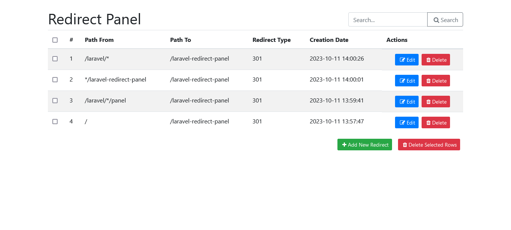
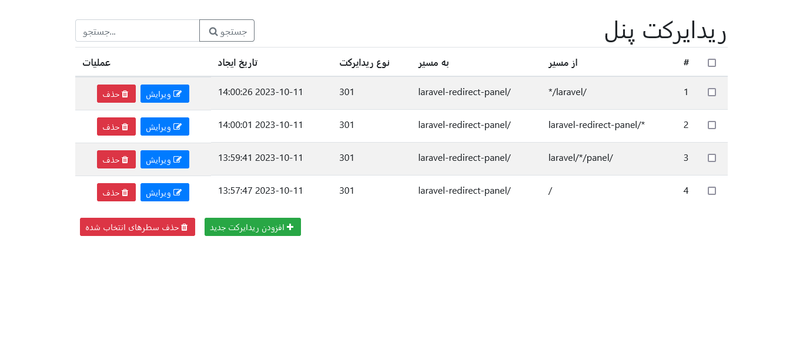

<p align="center"></p>

# Management panel for .htaccess file redirects.

[](https://packagist.org/packages/backendprogramer/laravel-redirect-panel)
[](https://github.com/backendprogramer/laravel-redirect-panel/actions?query=workflow%3Arun-tests+branch%3Amain)
[](https://github.com/backendprogramer/laravel-redirect-panel/actions?query=workflow%3A"Fix+PHP+code+style+issues"+branch%3Amain)
[](https://packagist.org/packages/backendprogramer/laravel-redirect-panel)

The Redirect Panel provides the capability to manage redirects in the .htaccess file. The Redirect Panel creates a table in the database, and every redirect added is stored both in the database and in the .htaccess file. When you edit or delete a redirect, the changes are also applied to the .htaccess file.

## Installation

You can install the package via composer:

```bash
composer require backendprogramer/laravel-redirect-panel
```

You can publish and run the migrations with:

```bash
php artisan vendor:publish --tag="laravel-redirect-panel-migrations"
php artisan migrate
```

You can publish the config file with:

```bash
php artisan vendor:publish --tag="laravel-redirect-panel-config"
```

This is the contents of the published config file:

```php
return [

    /* -----------------------------------------------------------------
     |  htaccess file path
     | -----------------------------------------------------------------
     |  Addressing should be done from the path of the public folder like "../../folder/.htaccess"
     */

    'htaccess'        => '.htaccess',

    /* -----------------------------------------------------------------
     |  Locale
     | -----------------------------------------------------------------
     |  Supported locales :
     |    'auto', 'en', 'fa'
     */

    'locale'        => 'auto',

    /* -----------------------------------------------------------------
     |  Direction
     | -----------------------------------------------------------------
     |  Supported directions :
     |    'ltr','rtl'
     */

    'direction'        => 'ltr',

    /* -----------------------------------------------------------------
     |  redirects per page
     | -----------------------------------------------------------------
     |  This defines how many redirects are displayed per page.
     */

    'per-page'      => 10,

    /* -----------------------------------------------------------------
     |  Colors
     | -----------------------------------------------------------------
     |  You can change color of these classes :
     |  btn-primary, btn-danger, btn-success, btn-secondary, text-danger
     */

    'colors' =>  [
//        'fg-color' => [
//            'btn-primary'       => '',
//            'btn-danger'        => '',
//            'btn-success'       => '',
//            'btn-secondary'     => '',
//            'text-danger'       => '',
//        ],
//        'bg-color' => [
//            'btn-primary'       => '',
//            'btn-danger'        => '',
//            'btn-success'       => '',
//            'btn-secondary'     => '',
//        ],
//        'border-color' => [
//            'btn-primary'       => '',
//            'btn-danger'        => '',
//            'btn-success'       => '',
//            'btn-secondary'     => '',
//        ],
    ],
];
```

Optionally, you can publish the views using

```bash
php artisan vendor:publish --tag="laravel-redirect-panel-views"
```

Optionally, you can publish the lang using

```bash
php artisan vendor:publish --tag="laravel-redirect-panel-lang"
```
## Artisan commands
To publish the config and translations files, views and migration run this command:

```bash
php artisan redirect-panel:publish
```

## Usage
To add to the router, please add the following code to the `routes/web.php` file. 
```php
Route::redirectPanel('laravel-redirect-panel');
```
## Supported localizations

| Local | Language |
|-------|----------|
| `en`  | English  |
| `fa`  | farsi    |

## Testing

```bash
composer test
```

## Changelog

Please see [CHANGELOG](CHANGELOG.md) for more information on what has changed recently.

## Contributing

Please see [CONTRIBUTING](CONTRIBUTING.md) for details.

## Security

If you discover any security related issues, please email `backend.programer.90@gmail.com` instead of using the issue tracker.

## Credits

- [Ali Ghorbani](https://github.com/backendprogramer)
- [All Contributors](../../contributors)

## License

The MIT License (MIT). Please see [License File](LICENSE.md) for more information.

## PREVIEW



